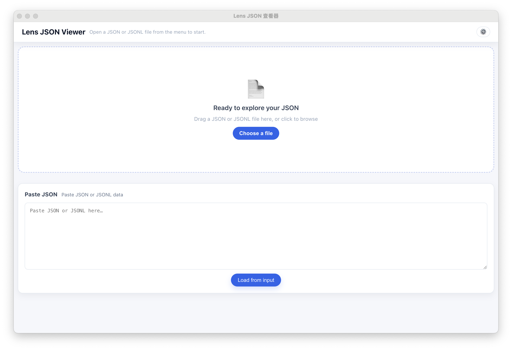
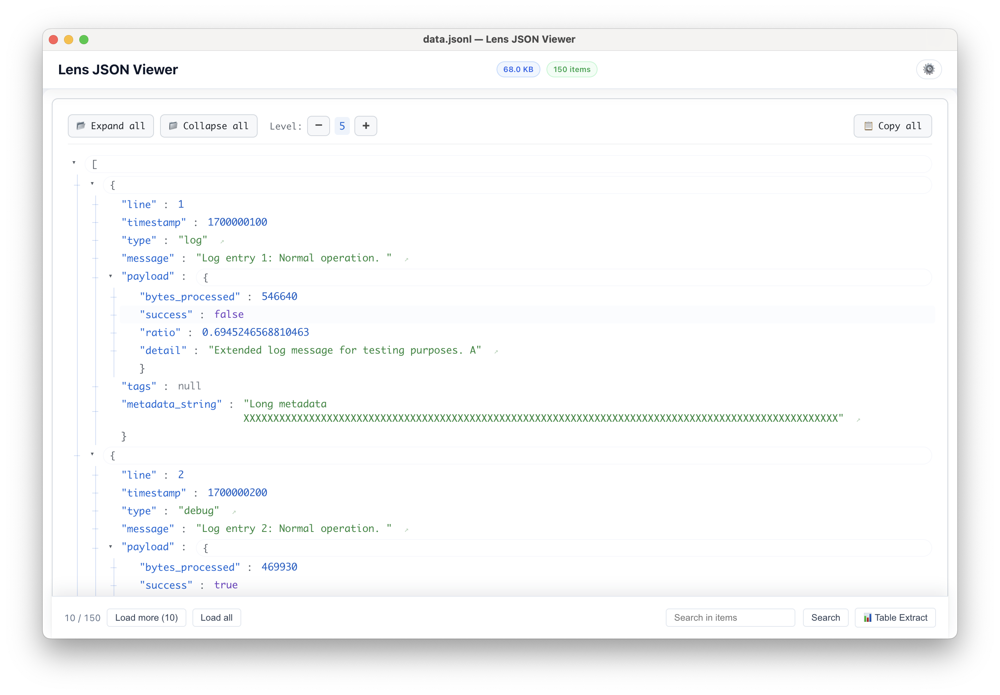
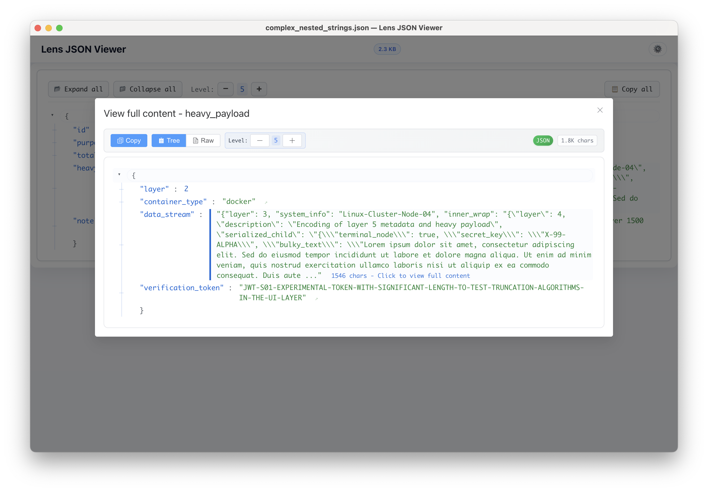

# 🔍 Lens JSON Viewer

一款轻量、快速的桌面应用，用于查看、搜索和格式化 JSON / JSONL 文件。基于 **Electron + Vite + Vue 3 + TypeScript** 构建。

> *Lens*（透镜）—— 像放大镜一样洞察你的 JSON 数据。

[English](README.md) | **中文**


---

## ✨ 功能特性

### 文件打开
- **菜单**：`File → Open…`（`⌘O` / `Ctrl+O`）
- **拖放**：直接将 `.json` / `.jsonl` 文件拖入窗口
- **文件关联**：在文件管理器中双击 JSON 文件即可用 Lens 打开

### 树形查看器
- 可折叠节点的层级树形视图
- 可调节展开深度（➖ / ➕ 控件）
- 一键「全部展开」/「全部折叠」
- 按值类型语法高亮（字符串、数字、布尔值、null）

### 大字符串处理
- 长字符串自动截断（默认：512 字符 / 5 行），点击可弹窗查看完整内容
- 弹窗支持 **树形视图** 和 **原始视图** 切换（当字符串本身是合法 JSON 时）
- 弹窗内支持 JSON 格式化 / 压缩和复制

### JSONL 支持
- 基于流的 JSONL 解析（使用 `ndjson`）
- 分页加载，可配置每页条数（默认：10 条）
- 「加载更多」/「加载全部」控件

### 搜索
- **页内查找**（`⌘F` / `Ctrl+F`）：原生 Electron `findInPage`，支持上一个/下一个导航和匹配计数
- **数组项搜索**：在底部控制栏中通过关键词过滤数组项

### 表格提取
- 从对象数组中提取结构化数据到表格视图
- 使用点号和数组索引定义自定义字段路径
- 保存和加载字段预设
- 导出为 CSV

### 外观
- 🌗 浅色 / 深色 / 跟随系统 三种主题模式
- 🌐 英文和中文界面

---

## 📸 截图

<p align="center">
  
  <br/>
  
  <br/>
  
</p>

---

## 🚀 快速开始

### 环境要求

- **Node.js** 20.19+ 或 22.12+
- **npm**（随 Node.js 附带）

### 安装与运行

```bash
# 克隆仓库
git clone https://github.com/gracece/lens-json-viewer.git
cd lens-json-viewer

# 安装依赖
npm install

# 以开发模式启动（Vite 开发服务器 + Electron）
npm run dev
```

### 生产构建

```bash
# 类型检查 + Vite 构建 + electron-builder 打包
npm run build
```

构建产物输出到 `release/<version>/` 目录：

| 平台 | 格式 | 架构 |
|------|------|------|
| macOS | DMG | arm64 |
| Windows | NSIS 安装程序 | x64 |
| Linux | AppImage | x64 |

---

## 🏗️ 项目结构

```
├── electron/
│   ├── main.ts                 # 主进程：窗口、菜单、IPC、文件读写
│   ├── preload.ts              # 预加载脚本：向渲染进程暴露 ipcRenderer
│   └── electron-env.d.ts       # Electron 环境类型声明
├── src/
│   ├── main.ts                 # Vue 应用入口
│   ├── App.vue                 # 根视图：文件加载、拖放、分页、搜索
│   ├── components/
│   │   ├── JsonViewerEnhanced.vue  # 树形容器：展开控制、复制、大字符串弹窗
│   │   ├── JsonNode.vue            # 递归树节点渲染
│   │   ├── TableExtractor.vue      # 表格提取对话框
│   │   └── SettingsDialog.vue      # 设置对话框（主题、语言、每页条数）
│   ├── composables/
│   │   └── useDarkMode.ts      # 深色模式组合式函数
│   ├── i18n/                   # 国际化（en / zh）
│   ├── utils/
│   │   └── copy.ts             # 剪贴板工具
│   └── style.css               # 全局样式和 CSS 变量
├── public/                     # 静态资源（图标）
├── electron-builder.json5      # electron-builder 配置
├── vite.config.ts              # Vite 配置
├── tsconfig.json               # TypeScript 配置
└── package.json
```

---

## ⌨️ 快捷键

| 快捷键 | 功能 |
|--------|------|
| `⌘O` / `Ctrl+O` | 打开文件 |
| `⌘F` / `Ctrl+F` | 页内查找 |
| `Enter` | 下一个匹配 |
| `Shift+Enter` | 上一个匹配 |
| `Esc` | 关闭搜索栏 |

---

## 🛠️ 技术栈

| 类别 | 技术 |
|------|------|
| 桌面框架 | Electron 40 |
| 前端框架 | Vue 3.4（Composition API + `<script setup>`） |
| 构建工具 | Vite 7 + vite-plugin-electron |
| UI 库 | Element Plus 2.7 |
| 语言 | TypeScript 5 |
| CSS | sass-embedded (SCSS) |
| JSONL 解析 | ndjson |
| 打包 | electron-builder（DMG / NSIS / AppImage） |

---

## 🤝 参与贡献

欢迎贡献！以下是参与方式：

1. **Fork** 本仓库
2. **创建** 功能分支（`git checkout -b feature/my-feature`）
3. **提交** 更改（`git commit -m 'Add some feature'`）
4. **推送** 到分支（`git push origin feature/my-feature`）
5. **发起** Pull Request

### 开发提示

- 推荐使用 **VS Code** 配合 [Volar](https://marketplace.visualstudio.com/items?itemName=Vue.volar) 扩展，以获得最佳的 Vue 3 + TypeScript 开发体验
- 如果 Vite 提示缺少 `sass-embedded`，运行 `npm install -D sass-embedded`
- JSON 解析在 **Web Worker** 中运行以保持 UI 流畅 —— 任何耗时计算都请保持此模式

### 需要帮助的方向

- 🎨 **应用图标**：项目需要一个正式的图标设计（目前使用占位图标）。希望设计一个以透镜/放大镜为主题的图标，提供 `.icns`（macOS）、`.ico`（Windows）和 `.png` 格式
- 🌍 **多语言翻译**：在中英文基础上添加更多语言支持
- 🧪 **测试**：单元测试和集成测试覆盖
- 📖 **文档**：完善代码内联文档

---

## 📋 已知限制

- 应用图标为占位图标，需要正式设计
- 在部分 Linux 发行版上，文件关联可能需要手动配置
- 超大文件（100MB+）可能导致初始解析较慢

---

## 📄 许可证

本项目基于 [MIT 许可证](LICENSE) 开源。

---

## 🙏 致谢

- [Electron](https://www.electronjs.org/)
- [Vue.js](https://vuejs.org/)
- [Vite](https://vitejs.dev/)
- [Element Plus](https://element-plus.org/)
- [vite-plugin-electron](https://github.com/electron-vite/vite-plugin-electron)
